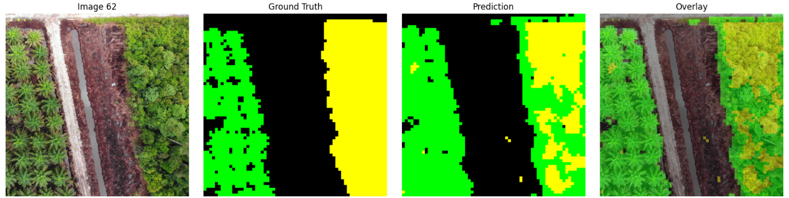
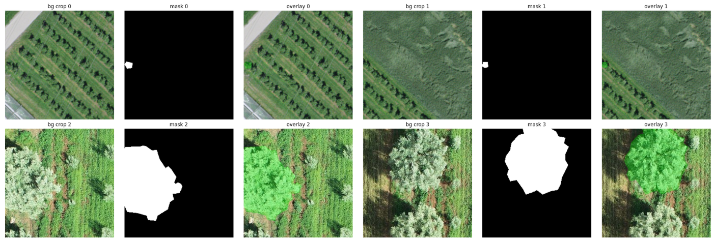
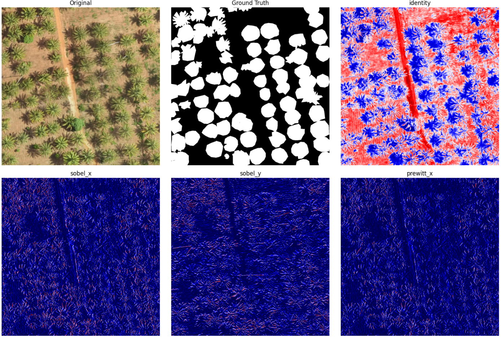

# Project Notebooks and Methods Documentation

Notebooks live under `notebooks/` as `.ipynb` files. Names below match the files in the repo.

## Notebook Overview

### `00 preflight check.ipynb`

- **Purpose:** Performs initial environment and dependency verification
- **Key Methods:**
    - Verifies Python environment setup
    - Checks required library installations
    - Validates system configurations

### `00_image_extract.ipynb`

- **Purpose:** Handles data extraction and initial preprocessing
- **Key Methods:**
    - Unpacks training and evaluation image archives
    - Removes extraneous system folders (such as `__MACOSX`)
    - Generates binary mask TIFFs from JSON polygon annotations
    - Visualizes image samples and channel statistics
    - Validates image and annotation alignment

### `00_preprocess_images.ipynb`

- **Purpose:** Converts imagery and builds training masks
- **Key Methods:**
    - Converts TIFF images to consistent RGB PNG format
    - Rasterizes polygon annotations into mask images
    - Populates `train_masks` and `evaluation_masks`

### `00 colab setup.ipynb`

- **Purpose:** Colab / Drive bootstrap
- **Key Methods:**
    - Mounts Google Drive
    - Loads `.env` values (including optional `TOKEN`)
    - Clones or refreshes the project repository

### `01_starter_sample.ipynb`

- **Purpose:** Demonstrates initial model prototyping
- **Key Methods:**
    - Implements basic PyTorch U-Net examples
    - Sets up initial data loading infrastructure
    - Performs sanity checks on model and data
      

### `02_class.ipynb`

- **Purpose:** Defines core model and data processing classes
- **Key Methods:**
    - Creates custom Dataset and Model classes
    - Implements data augmentation strategies
    - Builds flexible data handling utilities
      

### `02_exploration.ipynb`

- **Purpose:** Explores data and early model behavior
- **Key Methods:**
    - Visualizes training data
    - Analyzes image and mask statistics
    - Explores kernels and filters
    - Investigates performance metrics
      

### `03_training.ipynb`

- **Purpose:** Runs advanced model training workflows
- **Key Methods:**
    - Configures training pipelines
    - Implements loss functions
    - Sets up model checkpointing
    - Defines and runs validation strategies

### `04_evaluation.ipynb`

- **Purpose:** Evaluates model performance
- **Key Methods:**
    - Calculates performance metrics such as IoU, Dice, and Accuracy
    - Generates confusion matrices
    - Visualizes model predictions
    - Compares different model architectures
      

### `05_prediction.ipynb`

- **Purpose:** Runs model inference and builds submissions
- **Key Methods:**
    - Loads trained models and configuration
    - Runs inference on evaluation or test datasets
    - Generates competition submission JSON files
    - Visualizes prediction overlays on images

### `06_benchmark_models.ipynb`

- **Purpose:** Benchmarks multiple model configurations
- **Key Methods:**
    - Benchmarks different model architectures
    - Tracks inference speed and resource usage
    - Generates summary performance reports

### `07_data_analysis.ipynb`

- **Purpose:** Provides detailed data and error analysis
- **Key Methods:**
    - Runs statistical analysis on training and validation data
    - Investigates feature behavior and distributions
    - Performs error analysis and identifies model weaknesses
      

### `08_filter_experimentation.ipynb`

- **Purpose:** Experiments with image filtering pipelines
- **Key Methods:**
    - Implements and tests different image filters
    - Evaluates the impact of filters on training data
    - Generates filtered and enhanced training images
      

### `10_master_execution_plan_*.ipynb`

- **Purpose:** Orchestrates end-to-end experiments for a given tile size
- **Key Methods:**
    - Coordinates data preprocessing, training, evaluation, and prediction
    - Manages model training, validation, and submission generation
    - Tracks and compares experiment results across runs
- **Examples:** `10_master_execution_plan_512_rgb.ipynb`, `10_master_execution_plan_64_smp_unet.ipynb`

### `12_model_tracker_submission_manager_*.ipynb`

- **Purpose:** Ranks checkpoints and builds or refreshes submission JSON files
- **Key Methods:**
    - Scans experiment folders for metrics and model paths
    - Writes ranking reports
    - Generates missing competition submissions from trained checkpoints

### `_run_*.ipynb`

- **Purpose:** Convenience runners for a tile size or full suite
- **Examples:** `_run_64.ipynb`, `_run_128.ipynb`, `_run_512.ipynb`, `_run_all.ipynb`

## Cross-Cutting Methodologies

### Data Preprocessing

- Converts GeoTIFF to PNG with consistent channels
- Processes polygon annotations and builds masks
- Applies data augmentation policies
- Generates training and validation masks

### Model Development

- Implements semantic segmentation architectures such as U-Net and SimpleCNN
- Applies transfer learning when possible
- Supports multi-class segmentation setups
- Includes SMP, SegFormer, and YOLO variants in master plans

### Performance Tracking

- Computes metrics such as IoU, Dice, and Accuracy
- Manages model checkpoints and versioned runs
- Aggregates and summarizes experiment results

### Visualization Techniques

- Generates image and mask overlays
- Visualizes performance curves and metric trends
- Compares model predictions across architectures

## Best Practices and Recommendations

- Use appropriate data augmentation for robustness
- Apply cross validation or strong validation splits
- Monitor GPU memory and runtime during experiments
- Keep configuration-driven and reproducible experimental setups
