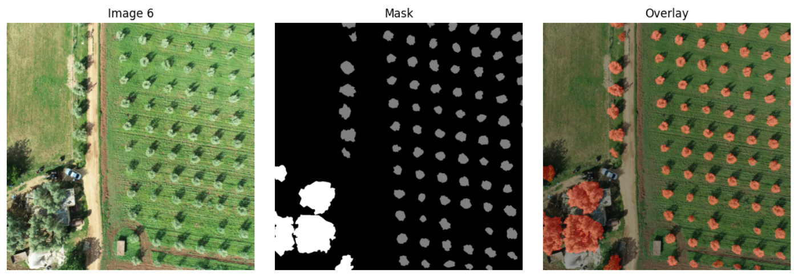
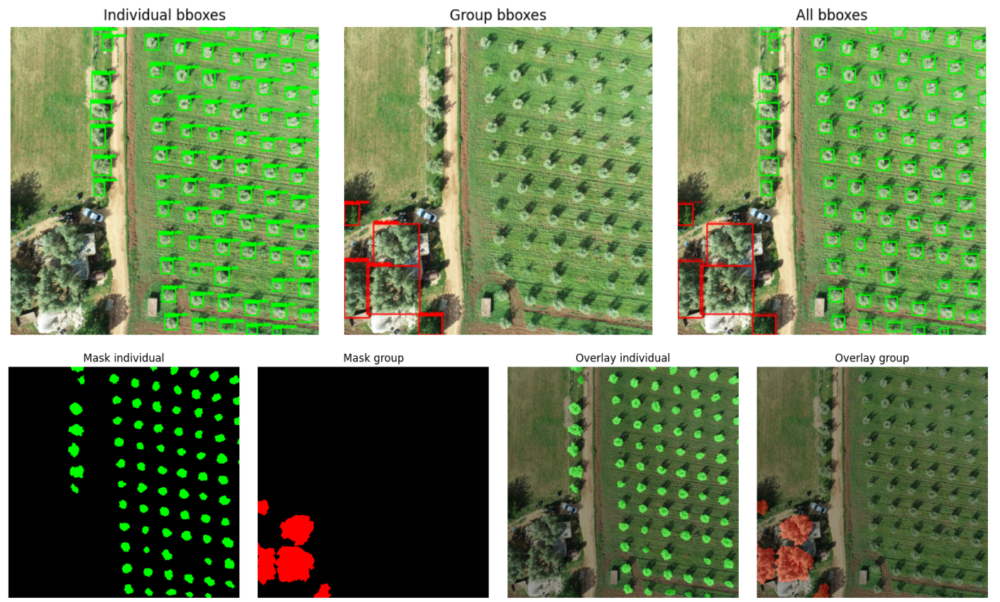
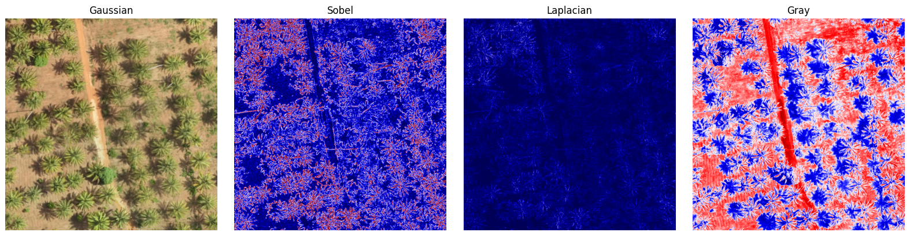

# Project Notebooks and Methods Documentation

Notebooks live under `notebooks/` as `.ipynb` files with unique numbers `01`–`15`.

## Pipeline (keep these for day-to-day work)

### `01_preflight_check.ipynb`

- Environment and dependency verification

### `02_image_extract.ipynb`

- Unpack training/evaluation archives
- Clean folders (e.g. `__MACOSX`)
- Build masks from polygon annotations

### `03_preprocess_images.ipynb`

- Convert TIFF → RGB PNG
- Populate `train_masks` / `evaluation_masks`

### `07_training.ipynb`

- Train/val splits, augmentations, Trainer, versioned checkpoints

### `08_evaluation.ipynb`

- Metrics (IoU, Dice, Accuracy), overlays, summaries

### `09_prediction.ipynb`

- Load a checkpoint, run inference, optional submission JSON

### `10_benchmark_models.ipynb`

- Standalone architecture compare (quality + speed) on a shared validation set

### `11_data_analysis.ipynb`

- Dataset stats, class distributions, image properties

### `12_filter_experimentation.ipynb`

- Systematic filter trials for canopy boundary enhancement

### `13_master_execution_plan_512_rgb.ipynb`

- End-to-end pipeline at tile size 512 (RGB / no-filter experiment set)

### `14_master_execution_plan_512_all.ipynb`

- End-to-end pipeline at tile size 512 including filter experiment variants

### `15_model_tracker_submission_manager.ipynb`

- Scan checkpoints, rank models, build/refresh submission JSON files

## Educational / exploration (`notebooks/`)

### `04_starter_sample.ipynb`

- Early prototyping walkthrough (dataset + sample model sanity checks)
  

### `05_class.ipynb`

- Mask/class/bbox exploration utilities
  

### `06_exploration.ipynb`

- Frequency space, kernels, filters, enhancement visualizations
  

## Cross-cutting methodologies

### Data preprocessing

- GeoTIFF → PNG, polygon masks, augmentation policies

### Model development

- U-Net / SimpleCNN / SMP / SegFormer / YOLO via `src.models.zoo`

### Performance tracking

- IoU, Dice, Accuracy; versioned checkpoints; submission export

## Best practices

- Prefer `config.yaml` + `src/` over duplicating logic in notebooks
- Use the 512 master plans for full runs; use 04–06 for teaching and EDA
- Keep configuration-driven, reproducible experiment setups
